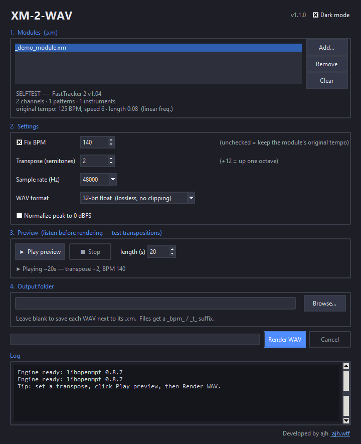

# XM-2-WAV

A small cross-platform program (**Windows · macOS · Linux**) that imports FastTracker II
`.xm` modules and renders them to **lossless WAV** at **any fixed BPM** and **any
transposition** — with an in-app **audio preview** so you can test transpositions before
committing to a render.



- **Faithful rendering** — audio is produced by [libopenmpt](https://lib.openmpt.org/)
  (the same engine used by OpenMPT and foobar2000), with the highest-quality 8-tap sinc
  interpolation. Instruments, samples, envelopes and effects are reproduced exactly.
- **Lossless output** — the default is **32-bit float WAV**, which stores the engine's
  native output verbatim: no quantisation, no clipping, full dynamic range. 24-bit and
  16-bit PCM are also available.
- **Musically-lossless BPM & transpose** — applied by editing the `.xm` *score* before
  rendering, not by DSP time-stretching or pitch-shifting. **No audio artifacts.**
- **Preview before rendering** — play a short clip at the current transpose/BPM to A/B
  different transpositions instantly.
- **Dark mode** (default) and light mode.

## Download & install

See **[INSTALL.md](INSTALL.md)** for full details. In short:

- **Windows** — download and run `XM-2-WAV.exe` (self-contained, no install needed).
- **macOS** — open `XM-2-WAV.dmg`, drag to Applications (first launch: right-click → Open).
- **Linux** — `XM-2-WAV-x86_64.AppImage` (any distro), or `yay -S xm-2-wav` on Arch (AUR).
- **Any OS with Python** — `pipx install "xm-2-wav[preview]"` (install libopenmpt + Tk first on macOS/Linux).

## Using it

1. **Add…** one or more `.xm` files.
2. Tick **Fix BPM** and choose a value (or leave it off to keep the original tempo).
3. Set **Transpose** in semitones (`+12` = up one octave).
4. Click **▶ Play preview** to hear the result; tweak the transpose and preview again.
5. Pick sample rate and WAV format (32-bit float is the lossless default).
6. Choose an output folder (or leave blank to save next to each `.xm`).
7. **Render WAV**.

Output files are named `‹song›_bpm‹N›_t‹±N›.wav`.

### Command line (bonus)

The same executable also works headless when given arguments:

```
XM-2-WAV.exe song.xm --bpm 140 --transpose 3 --format float32
XM-2-WAV.exe a.xm b.xm --bpm 120 --outdir renders
```

Options: `--bpm N`, `--transpose N`, `--samplerate N`, `--format float32|pcm24|pcm16`,
`--normalize`, `--outdir DIR`, `--out FILE`.

## What "fixed BPM" means

The song is forced to a single constant BPM: the module's default-BPM field is rewritten
and every in-song "set BPM" effect (`Fxx` with `xx ≥ 0x20`) is removed. Speed (ticks-per-row)
automation is preserved, since that is a separate parameter from BPM.

## What "transposition" means

Every note event in every pattern is shifted by the chosen number of semitones (notes are
clamped to the valid range). This is the exact operation a tracker performs when you
transpose a song — multi-sampled instruments follow their key maps correctly, and there is
no resampling of already-rendered audio.

## How it works

```
 .xm bytes ──► xmwav.xmedit ──► edited .xm bytes ──► libopenmpt ──► float32 ──► WAV
              (transpose notes,     (samples/instruments   (8-tap sinc)   (xmwav.wavio)
               rewrite BPM)          untouched)
```

- `xmwav/xmedit.py`  — pure, dependency-free in-place `.xm` editor (transpose + fix BPM).
- `xmwav/engine.py`  — `ctypes` wrapper that finds libopenmpt (bundled on Windows, system lib on macOS/Linux).
- `xmwav/wavio.py`   — minimal float32 / 24-bit / 16-bit WAV writer/encoder.
- `xmwav/player.py`  — cross-platform preview playback (`winsound` on Windows, `sounddevice` elsewhere).
- `xmwav/theme.py`   — dark / light theming.
- `xmwav/convert.py` — edit → render → write.
- `xmwav/cli.py`     — CLI + GUI dispatcher (backs the `xm-2-wav` entry points).
- `xmwav/app.py`     — Tkinter GUI.

On Windows the libopenmpt DLLs are bundled in `xmwav/libs/`. On macOS/Linux the app uses
the system libopenmpt (`brew install libopenmpt` / `pacman -S libopenmpt` / `apt install libopenmpt0`).

## Building the downloads

Each platform's build recipe lives in `packaging/`, and the GitHub Actions workflow
`.github/workflows/build.yml` builds **all three** on real runners and cuts a Release on
version tags. See **[INSTALL.md](INSTALL.md#for-packagers--developers-building-the-downloads)**
for the per-OS commands. Quick reference:

```bash
# Windows
./build.ps1
# macOS
bash packaging/macos/build_app.sh
# Linux (AppImage)
bash packaging/linux/build_appimage.sh
# Python wheel/sdist
python -m build
```

Run the GUI without building: `python xm_to_wav.py` (or `python -m xmwav`).

## Tests

```powershell
python -m tests.selftest      # editor + engine: FFT-verified pitch, duration, WAV formats
python -m tests.gui_smoke     # GUI widget wiring + theming
python -m tests.gui_render    # GUI render worker end-to-end
```

`tests/selftest.py` synthesises a known module and checks, among other things, that
`+12` semitones doubles the pitch, `+7` gives a perfect fifth, and doubling the BPM halves
the duration.

## Credits

Developed by **1ajh** ([ajh.wtf](https://ajh.wtf)), built with **Claude** (Anthropic).

Rendering by [libopenmpt](https://lib.openmpt.org/) (BSD license; see
`vendor/LICENSE.libopenmpt.txt`).
